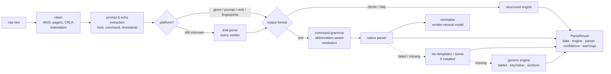

# clijson — router CLI output → JSON

[](https://github.com/shadymagdy/network-cli-parser/actions/workflows/ci.yml)
[](https://shadymagdy.github.io/network-cli-parser/)
[](pyproject.toml)
[](pyproject.toml)
[](https://github.com/astral-sh/uv)
[](https://github.com/astral-sh/ruff)
[](LICENSE)

📖 **Documentation: <https://shadymagdy.github.io/network-cli-parser/>**

**clijson** (repo: `network-cli-parser`) turns the output of `show` / `display` commands from
**Cisco IOS XR**, **Juniper Junos** and **Huawei VRP** routers into clean, predictable JSON.
It has **no runtime dependencies**.

```python
>>> import clijson
>>> r = clijson.parse(open("pe1.log").read())        # platform and command are auto-detected
>>> r.parser, r.platform
('iosxr.show_bgp_summary', 'iosxr')
>>> r.data["neighbors"][0]
{'neighbor': '10.255.0.2', 'instance': 'default', 'vrf': 'default', 'address_family': 'ipv4 unicast',
 'remote_as': 65000, 'messages_received': 12011, ..., 'up_down': '1w2d', 'state': 'Established',
 'prefixes_received': 512}
```

## Why clijson

| Feature | What you get |
|---|---|
| **Works on any command** | 178 dedicated parsers (259 command patterns). Anything else goes through a **generic engine** that finds tables, `key: value` pairs and indented sections in *any* output, so you always get JSON back. |
| **Understands you like a router does** | `sh ip int br`, `dis int br` and `show interfaces brief` all resolve. Huawei accepts `show` as well as `display`. Parameters such as a VRF or interface are captured. |
| **Zero configuration** | The platform is detected from the prompt, the command verb or fingerprints in the output. If those don't settle it, **trial parsing** lets each vendor's parser try and keeps the one that understands the output. Echoed prompts, `--More--` pagers, ANSI codes, timestamps and `{master}` lines are removed. |
| **One model for all vendors** | `normalize=True` adds a **vendor-neutral view** for 20 common concepts (BGP peers, interfaces, routes, LLDP, OSPF/IS-IS/LDP, ARP/ND, BFD, LAG, VRFs, L2VPN pseudowires, …), so one script can handle all three vendors. |
| **Structured output is native** | Junos `| display json` / `| display xml` output is recognised and flattened into clean snake_case JSON. |
| **Config as data** | `show running-config`, `show configuration` (curly braces or `| display set`) and `display current-configuration` become nested trees. |
| **Whole sessions** | Paste a terminal log with 20 commands and get 20 results (`parse_session`). |
| **Pre/post change checks** | `clijson.diff(before, after)` (or `clijson diff pre.txt post.txt`) matches records by their natural key (neighbor, interface, prefix, …) and ignores counters and timers by default, so only real changes are reported. |
| **Clear about failures** | Device errors (`% Invalid input`, `syntax error`, `Error: Unrecognized command`) come back as `engine="device-error"` with the message, instead of garbage data. |
| **Stands on giants' shoulders** | If you have [ntc-templates](https://github.com/networktocode/ntc-templates) or [Cisco Genie](https://github.com/CiscoTestAutomation/genieparser) installed, their templates become extra fallback engines automatically. |
| **Tells you how it got the answer** | Every result carries `engine`, `parser`, `confidence`, `warnings` (for example "output was filtered by `| include`") and metadata such as the hostname and timestamp. |
| **Tested on real output** | 269 regression fixtures: 217 captured from real ASR9K, NCS5500, 8000, CRS, XRv, MX, PTX, QFX, EX, SRX, NE40E, CX600, ATN, CE, S and AR devices, plus 52 written from vendor documentation formats. |
| **Easy to use from any language** | Python API, a full CLI (`clijson`), and a zero-dependency HTTP API (`clijson serve`). |
| **Built for AI assistants** | `clijson mcp` is a [Model Context Protocol](https://modelcontextprotocol.io) server. Claude, Cursor, VS Code and any agent can call clijson as a tool and reason over exact, schema'd data. |

## What it looks like

Input: a Huawei capture pasted straight from the terminal, prompt included.

```text
<PE1>display interface brief
PHY: Physical
*down: administratively down
Interface                   PHY   Protocol  InUti OutUti   inErrors  outErrors
Eth-Trunk1                  up    up        0.01%  0.38%          0          0
  GigabitEthernet0/0/1      up    up        0.01%  0.40%          0          0
  GigabitEthernet0/0/2      up    up           0%  0.36%          0          0
GigabitEthernet0/0/3        *down down         0%     0%          0          0
LoopBack0                   up    up(s)        0%     0%          0          0
<PE1>
```

`clijson pe1.txt` detects Huawei VRP and `display interface brief`, nests the trunk members and decodes the
flags. Output is abbreviated here:

```json
[
  {"interface": "Eth-Trunk1", "physical": "up", "protocol": "up", "input_utilization": 0.01, "output_utilization": 0.38,
   "input_errors": 0, "output_errors": 0,
   "members": [{"interface": "GigabitEthernet0/0/1", "physical": "up", "protocol": "up", ...},
               {"interface": "GigabitEthernet0/0/2", ...}]},
  {"interface": "GigabitEthernet0/0/3", "physical": "down", "protocol": "down", "admin_down": true, ...},
  {"interface": "LoopBack0", "physical": "up", "protocol": "up", "flags": ["spoofing"], ...}
]
```

`clijson pe1.txt -n` gives the vendor-neutral view. It has the same shape for IOS XR and Junos:

```json
[{"name": "Eth-Trunk1", "admin_status": "up", "oper_status": "up", "ip_address": null, "vrf": null, "description": null},
 {"name": "GigabitEthernet0/0/3", "admin_status": "admin-down", "oper_status": "down", ...}, ...]
```

## Install

```bash
pip install clijson                 # core, no dependencies
pip install "clijson[all]"          # + YAML output, pretty tables, ntc-templates fallback
pip install "clijson[netmiko]"      # + collect from live devices (or [scrapli])
pip install "clijson[mcp]"          # + MCP server for AI assistants
```

With [uv](https://docs.astral.sh/uv/):

```bash
uv add clijson                      # add to your project
uvx clijson parse show_bgp.txt      # run the CLI without installing anything
```

Requires Python 3.10 or newer.

## Quick start

### Python

```python
import clijson

# 1. Tell it everything...
r = clijson.parse(output, "show ipv4 interface brief", platform="iosxr")

# 2. ...or nothing: prompt lines like "RP/0/RP0/CPU0:PE1#show ipv4 int br" are recognised
r = clijson.parse(output)

r.data                 # structured data (dict / list)
r.to_json()            # JSON string
r.to_yaml()            # needs PyYAML
r.to_dict()            # data + provenance (engine, parser, confidence, warnings, metadata)
r.records()            # the most table-like view as flat rows
r.to_dataframe()       # the same rows as a pandas DataFrame (needs pandas)
```

**Pre/post maintenance check**:

```python
before = clijson.parse(pre_capture, "show bgp summary", "iosxr", normalize=True)
after = clijson.parse(post_capture, "show bgp summary", "iosxr", normalize=True)
for change in clijson.diff(before, after):
    print(change)
# ~ [neighbor=10.255.0.2].state: 'Established' -> 'Idle'
# - [neighbor=10.255.0.4]: {...}
# + [neighbor=10.255.0.5]: {...}
```

**Same code for every vendor** with the normalized view:

```python
jobs = [("pe1-xr.txt",  "show bgp summary", "iosxr"),
        ("pe2-mx.txt",  "show bgp summary", "junos"),
        ("pe3-ne.txt",  "display bgp peer", "vrp")]

for path, cmd, platform in jobs:
    r = clijson.parse(open(path).read(), cmd, platform, normalize=True)
    for peer in r.normalized:
        if not peer["established"]:
            print(f"{path}: {peer['neighbor']} AS{peer['remote_as']} is {peer['state']}")
```

**A whole terminal session** (PuTTY/SecureCRT/`script` log):

```python
for r in clijson.parse_session(open("maintenance-window.log").read()):
    print(r.metadata.get("hostname"), r.command, r.parser)
```

**Masking secrets** before results are stored or shared. Passwords, keys, SNMP communities and crypt strings
become `<redacted>`, and configuration trees still parse:

```python
r = clijson.parse(config_text, "show configuration | display set", "junos", redact=True)
clijson.redact(text)                     # mask any text
```

**Checking configuration statements**, the same way on Junos (`set` or `{ }`), IOS XR and VRP:

```python
r = clijson.parse(config_text, "show running-config", "iosxr")
clijson.config.has(r, "router bgp 65000 neighbor 192.0.2.1 remote-as 65000")   # True / False
clijson.config.lines(r)                  # one full-path line per statement
```

**Live devices** (via scrapli or netmiko). You can try it against containerlab XRd / cRPD / vJunos / VRP images:

```python
from clijson.live import collect
results = collect("10.0.0.1", "junos", ["show version", "show bgp summary"],
                  username="lab", password="lab123", normalize=True)
```

### Command line

```bash
clijson parse show_bgp.txt -p iosxr -c "show bgp summary"
ssh mx1 "show interfaces terse" | clijson parse -p junos -c "show interfaces terse"
clijson session.log                              # every command in a log (shorthand for `parse`)
clijson parse out.txt -c "dis bgp peer" -n -f table   # normalized, as a table
clijson parse out.txt -m                         # include engine/parser/confidence/warnings
clijson diff pre.txt post.txt -c "show bgp summary"   # what changed? (exit code 1 if anything did)
clijson commands -p vrp --search lldp            # what is supported?
clijson detect mystery.txt                       # which OS produced this?
clijson schema bgp.summary                       # JSON Schema of a normalized model
clijson run 10.0.0.1 -p iosxr -c "show version" -c "show bgp summary" -u admin
clijson serve --port 8080                        # HTTP API for other languages/tools
clijson mcp                                      # MCP server for AI assistants
```

### HTTP API

```bash
clijson serve --port 8080 &
curl -s localhost:8080/parse -d '{"platform":"vrp","command":"display interface brief","output":"...","normalize":true}'
curl -s "localhost:8080/commands?platform=junos"
```

### Cisco NSO

Use it inside NSO services and actions to turn `live-status exec` output into data:

```python
import clijson.nso

res = clijson.nso.show(root.devices.device["pe1"], "show bgp summary", normalize=True)
```

The platform comes from the device's NED. RESTCONF, JSON-RPC and `ncs_cli` output can also go straight to
`clijson.parse()`, and `clijson.nso.unwrap()` returns the device text from any of them. `redact=True` masks
secrets. See **[docs/guides/cisco-nso.md](docs/guides/cisco-nso.md)**.

### AI assistants (MCP)

```bash
claude mcp add clijson -- uvx --from "clijson[mcp]" clijson mcp     # Claude Code
```

For Claude Desktop, Cursor or VS Code, add the same command (`uvx --from clijson[mcp] clijson mcp`) to the
client's MCP config. The assistant gets read-only tools: `parse_output`, `parse_session`, `detect_platform`,
`diff_outputs`, `list_commands`, `get_model_schema` and `check_pseudowire_redundancy`. Setup for each client and the HTTP transport are
covered in **[docs/mcp.md](docs/mcp.md)**.

## How it works



* **Command grammar.** Parsers declare what they understand using the notation from vendor documentation:
  `show bgp [instance <instance>] [vrf (all|<vrf>)] [<afi> [<safi>]] summary`.
  Typed commands are scored against every pattern. Exact keywords beat abbreviations and abbreviations beat
  parameters, so `show interfaces brief` never gets mistaken for `show interfaces <interface>`.
* **Engines** are tried in order: `native → ntc → genie → generic`. Optional engines are skipped if they
  aren't installed. Use `engines=[...]` to choose your own order, or `strict=True` to accept only a dedicated parser.
* **Provenance.** Each result has a `confidence` score: 1.0 for native and structured output, 0.9 for
  ntc/Genie, 0.4–0.6 for generic. Automation can decide how much to trust a result.

More detail: [docs/architecture.md](docs/architecture.md).

## Supported platforms and commands

| Platform | Aliases (any of these work) | Dedicated parsers |
|---|---|---:|
| Cisco IOS XR (ASR9K, NCS 540/5500/5700, 8000, CRS, XRv 9000, XRd) | `iosxr`, `xr`, `cisco_xr`, `ios-xr`, … | 69 |
| Juniper Junos / Junos Evolved (MX, PTX, ACX, QFX, EX, SRX, vMX, cRPD) | `junos`, `juniper`, `juniper_junos`, `evo`, … | 54 |
| Huawei VRP (NE40E/NE8000, CX600, ATN, CE, S, AR) | `vrp`, `huawei`, `huawei_vrp`, `vrpv8`, … | 55 |

They cover the commands you run every day: version and inventory, platform and RE/FPC state, CPU, memory,
power, fans and temperature, interfaces (brief, detail, description, counters, optics/DOM), LAG/LACP, IPv4/IPv6
addressing, ARP/ND and MAC tables, VLANs, LLDP/CDP, RIB (brief and detail/extensive), BGP (summary, neighbor detail,
advertised/received routes and BGP RIB, including VRF, instance and address family), OSPF/OSPFv3, IS-IS, MPLS LDP,
RSVP-TE tunnels and LSPs, LFIB, BFD, HSRP/VRRP, PIM, VRFs and VPN instances, L2VPN xconnects, bridge domains,
VPLS/VSI pseudowires and their MAC tables, EVPN, ping, firewall filters, ACLs, SRX cluster and policies, NTP, users, alarms, logging, licenses, file systems,
commit history, startup/patch info and running configuration.

The full, generated list is in **[docs/commands.md](docs/commands.md)**. You can also run `clijson commands`.

## Normalized models

With `normalize=True`, commands that map to a common concept return records with **exactly** these fields on
every vendor:

| Model | Fields |
|---|---|
| `system.version` | hostname, vendor, os, version, model, serial_number, uptime, uptime_seconds |
| `interfaces.brief` | name, admin_status, oper_status, ip_address, vrf, description |
| `interfaces.detail` | name, admin_status, oper_status, description, mac_address, mtu, bandwidth_kbps, ipv4_addresses, input/output rate & packets & errors |
| `bgp.summary` | neighbor, remote_as, state, established, uptime, uptime_seconds, prefixes_received, vrf, address_family |
| `routes` | prefix, protocol, next_hops, distance, metric, vrf, age |
| `lldp.neighbors` | local_interface, neighbor, neighbor_interface, chassis_id, capabilities, ttl |
| `l2vpn.pseudowires` | service, neighbor, pw_id, state, role (primary/backup), active, vc_type, mtu, local_label, remote_label, status_code, local/remote_status_code, control_word, pw_status_tlv, flow_label_tx/rx. See the [pseudowire checks guide](docs/guides/pseudowire-checks.md). |
| `ping` | target, sent, received, loss_percent, success, rtt_min, rtt_avg, rtt_max |
| `ospf.neighbors`, `isis.adjacency`, `ldp.neighbors`, `bfd.sessions`, `arp`, `ipv6.neighbors`, `mac.table`, `lag`, `vrfs`, `inventory`, `cpu`, `interfaces.description` | see [docs/models.md](docs/models.md) |

Normalized values are standardised too. Statuses become `up` / `down` / `admin-down`, MACs become
`aa:bb:cc:dd:ee:ff`, and uptimes, ages and timers are also given in seconds.

**Typed and schema'd.** Every model is a `TypedDict` (`clijson.models.BgpNeighbor`, `Route`, `Interface`, ...), so
editors autocomplete fields and mypy/pyright check your code. Every model also has a JSON Schema (draft 2020-12)
for consumers in other languages, API contracts or data pipelines:

```python
from typing import cast
from clijson.models import BgpNeighbor, json_schema, validate

peers = cast(list[BgpNeighbor], clijson.parse(text, "show bgp summary", "iosxr", normalize=True).normalized)
json_schema("bgp.summary")          # dict, ready for json.dump / OpenAPI / pydantic / jsonschema
validate("bgp.summary", peers)      # [] when the data matches the model
```

```bash
clijson schema                                  # list the models
clijson schema routes > routes.schema.json      # print one
clijson schema --out schemas/                   # export all of them
clijson parse out.txt -c "show arp" -n | clijson schema arp --check -   # validate output in CI
```

The generated schemas are also committed under [`schemas/`](schemas/).

## Extending

Adding a parser takes a decorator and a method. Run `python scripts/fixture.py add` to add a regression test for it:

```python
from typing import Any

from clijson import Parser, register
from clijson.textutils import match_lines

@register("iosxr", "show hsrp [<interface>] brief", intent=None)
class ShowHsrpBrief(Parser):
    """HSRP groups, state and virtual IP."""

    def parse(self, text: str) -> list[dict[str, Any]]:
        return [m.groupdict() for m in match_lines(
            r"^\s*(?P<interface>\S+)\s+(?P<group>\d+)\s+(?P<priority>\d+)\s+(?P<state>\w+)\s+(?P<vip>\S+)", text)]
```

Third-party packages can ship parsers through the `clijson.parsers` entry point. See
[docs/writing-parsers.md](docs/writing-parsers.md).

## Testing against real routers

`lab/` has a [containerlab](https://containerlab.dev) topology with Cisco XRd, Juniper vJunos/cRPD and Huawei
VRP. `scripts/harvest.py` runs every supported command on each device (live or emulated), saves the raw output
and reports how much of it parsed natively. This is how new OS releases get checked. See
[lab/README.md](lab/README.md).

## Development

The project is managed with [uv](https://docs.astral.sh/uv/) (`uv.lock` pins every tool):

```bash
uv sync                                 # create .venv with the dev dependency group
uv run pre-commit install               # ruff lint + format on every commit
uv run pytest                           # ~4700 tests incl. 269 fixtures
uv run ruff check . && uv run ruff format .
uv run mypy                             # strict type check
uv run scripts/fixture.py check         # or `update` after an intentional parser change
uv run scripts/gen_docs.py              # refresh docs/commands.md, docs/models.md and schemas/
uv run --group docs zensical serve      # preview the documentation site
```

See [CONTRIBUTING.md](CONTRIBUTING.md).

## License

MIT. Some regression fixtures were taken from the Apache-2.0 licensed
[ntc-templates](https://github.com/networktocode/ntc-templates) and
[genieparser](https://github.com/CiscoTestAutomation/genieparser) projects. See
[tests/fixtures/NOTICE.md](tests/fixtures/NOTICE.md).
