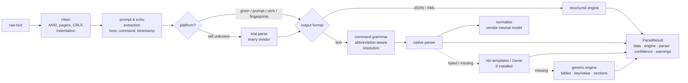

# clijson — router CLI output → JSON

**clijson** (repo: `network-cli-parser`) turns the output of `show` / `display` commands from
**Cisco IOS XR**, **Juniper Junos** and **Huawei VRP** routers into clean, predictable JSON.
It has **no runtime dependencies**.

```python
>>> import clijson
>>> r = clijson.parse(open("pe1.log").read())        # platform and command are auto-detected
>>> r.parser, r.platform
('iosxr.show_bgp_summary', 'iosxr')
>>> r.data["neighbors"][0]
{'neighbor': '10.255.0.2', 'instance': 'default', 'vrf': 'default', 'address_family': 'ipv4 unicast',
 'remote_as': 65000, 'messages_received': 12011, ..., 'up_down': '1w2d', 'state': 'Established',
 'prefixes_received': 512}
```

## Why clijson

| | |
|---|---|
| **Works on any command** | 124 dedicated parsers (190 command patterns). Anything else goes through a **generic engine** that finds tables, `key: value` pairs and indented sections in *any* output, so you always get JSON back. |
| **Understands you like a router does** | `sh ip int br`, `dis int br` and `show interfaces brief` all resolve. Huawei accepts `show` as well as `display`. Parameters such as a VRF or interface are captured. |
| **Zero configuration** | The platform is detected from the prompt, the command verb or fingerprints in the output. If those don't settle it, **trial parsing** lets each vendor's parser try and keeps the one that understands the output. Echoed prompts, `--More--` pagers, ANSI codes, timestamps and `{master}` lines are removed. |
| **One model for all vendors** | `normalize=True` adds a **vendor-neutral view** for 18 common concepts (BGP peers, interfaces, routes, LLDP, OSPF/IS-IS/LDP, ARP/ND, BFD, LAG, VRFs, …), so one script can handle all three vendors. |
| **Structured output is native** | Junos `| display json` / `| display xml` output is recognised and flattened into clean snake_case JSON. |
| **Config as data** | `show running-config`, `show configuration` (curly braces or `| display set`) and `display current-configuration` become nested trees. |
| **Whole sessions** | Paste a terminal log with 20 commands and get 20 results (`parse_session`). |
| **Stands on giants' shoulders** | If you have [ntc-templates](https://github.com/networktocode/ntc-templates) or [Cisco Genie](https://github.com/CiscoTestAutomation/genieparser) installed, their templates become extra fallback engines automatically. |
| **Tells you how it got the answer** | Every result carries `engine`, `parser`, `confidence`, `warnings` (for example "output was filtered by `| include`") and metadata such as the hostname and timestamp. |
| **Tested on real output** | 185 regression fixtures captured from real ASR9K, NCS5500, 8000, CRS, XRv, MX, PTX, QFX, EX, SRX, NE40E, CX600, ATN, CE, S and AR devices. |
| **Easy to use from any language** | Python API, a full CLI (`clijson`), and a zero-dependency HTTP API (`clijson serve`). |

## Install

```bash
pip install clijson                 # core, no dependencies
pip install "clijson[all]"          # + YAML output, pretty tables, ntc-templates fallback
pip install "clijson[netmiko]"      # + collect from live devices (or [scrapli])
```

From source: `pip install -e ".[dev]"`. Requires Python 3.8 or newer.

## Quick start

### Python

```python
import clijson

# 1. Tell it everything...
r = clijson.parse(output, "show ipv4 interface brief", platform="iosxr")

# 2. ...or nothing: prompt lines like "RP/0/RP0/CPU0:PE1#show ipv4 int br" are recognised
r = clijson.parse(output)

r.data                 # structured data (dict / list)
r.to_json()            # JSON string
r.to_yaml()            # needs PyYAML
r.to_dict()            # data + provenance (engine, parser, confidence, warnings, metadata)
```

**Same code for every vendor** with the normalized view:

```python
jobs = [("pe1-xr.txt",  "show bgp summary", "iosxr"),
        ("pe2-mx.txt",  "show bgp summary", "junos"),
        ("pe3-ne.txt",  "display bgp peer", "vrp")]

for path, cmd, platform in jobs:
    r = clijson.parse(open(path).read(), cmd, platform, normalize=True)
    for peer in r.normalized:
        if not peer["established"]:
            print(f"{path}: {peer['neighbor']} AS{peer['remote_as']} is {peer['state']}")
```

**A whole terminal session** (PuTTY/SecureCRT/`script` log):

```python
for r in clijson.parse_session(open("maintenance-window.log").read()):
    print(r.metadata.get("hostname"), r.command, r.parser)
```

**Live devices** (via scrapli or netmiko). You can try it against containerlab XRd / cRPD / vJunos / VRP images:

```python
from clijson.live import collect
results = collect("10.0.0.1", "junos", ["show version", "show bgp summary"],
                  username="lab", password="lab123", normalize=True)
```

### Command line

```bash
clijson parse show_bgp.txt -p iosxr -c "show bgp summary"
ssh mx1 "show interfaces terse" | clijson parse -p junos -c "show interfaces terse"
clijson session.log                              # every command in a log (shorthand for `parse`)
clijson parse out.txt -c "dis bgp peer" -n -f table   # normalized, as a table
clijson parse out.txt -m                         # include engine/parser/confidence/warnings
clijson commands -p vrp --search lldp            # what is supported?
clijson detect mystery.txt                       # which OS produced this?
clijson run 10.0.0.1 -p iosxr -c "show version" -c "show bgp summary" -u admin
clijson serve --port 8080                        # HTTP API for other languages/tools
```

### HTTP API

```bash
clijson serve --port 8080 &
curl -s localhost:8080/parse -d '{"platform":"vrp","command":"display interface brief","output":"...","normalize":true}'
curl -s "localhost:8080/commands?platform=junos"
```

## How it works



* **Command grammar.** Parsers declare what they understand using the notation from vendor documentation:
  `show bgp [instance <instance>] [vrf (all|<vrf>)] [<afi> [<safi>]] summary`.
  Typed commands are scored against every pattern. Exact keywords beat abbreviations and abbreviations beat
  parameters, so `show interfaces brief` never gets mistaken for `show interfaces <interface>`.
* **Engines** are tried in order: `native → ntc → genie → generic`. Optional engines are skipped if they
  aren't installed. Use `engines=[...]` to choose your own order, or `strict=True` to accept only a dedicated parser.
* **Provenance.** Each result has a `confidence` score: 1.0 for native and structured output, 0.9 for
  ntc/Genie, 0.4–0.6 for generic. Automation can decide how much to trust a result.

More detail: [docs/architecture.md](docs/architecture.md).

## Supported platforms and commands

| Platform | Aliases (any of these work) | Dedicated parsers |
|---|---|---:|
| Cisco IOS XR (ASR9K, NCS 540/5500/5700, 8000, CRS, XRv 9000, XRd) | `iosxr`, `xr`, `cisco_xr`, `ios-xr`, … | 46 |
| Juniper Junos / Junos Evolved (MX, PTX, ACX, QFX, EX, SRX, vMX, cRPD) | `junos`, `juniper`, `juniper_junos`, `evo`, … | 39 |
| Huawei VRP (NE40E/NE8000, CX600, ATN, CE, S, AR) | `vrp`, `huawei`, `huawei_vrp`, `vrpv8`, … | 39 |

They cover the commands you run every day: version and inventory, platform and RE/FPC state, CPU and memory,
interfaces (brief, detail, description, counters, optics), LAG/LACP, IPv4/IPv6 addressing, ARP/ND and MAC tables,
VLANs, LLDP/CDP, RIB (brief and detail/extensive), BGP (summary and neighbor detail, including VRF, instance and
address family), OSPF/OSPFv3, IS-IS, MPLS LDP, RSVP/LSPs, LFIB, BFD, VRFs and VPN instances, L2VPN xconnects,
NTP, users, alarms, logging, commit history, startup/patch info and running configuration.

The full, generated list is in **[docs/commands.md](docs/commands.md)**. You can also run `clijson commands`.

## Normalized models

With `normalize=True`, commands that map to a common concept return records with **exactly** these fields on
every vendor:

| Model | Fields |
|---|---|
| `system.version` | hostname, vendor, os, version, model, serial_number, uptime, uptime_seconds |
| `interfaces.brief` | name, admin_status, oper_status, ip_address, vrf, description |
| `interfaces.detail` | name, admin_status, oper_status, description, mac_address, mtu, bandwidth_kbps, ipv4_addresses, input/output rate & packets & errors |
| `bgp.summary` | neighbor, remote_as, state, established, uptime, uptime_seconds, prefixes_received, vrf, address_family |
| `routes` | prefix, protocol, next_hops, distance, metric, vrf, age |
| `lldp.neighbors` | local_interface, neighbor, neighbor_interface, chassis_id, capabilities, ttl |
| `ospf.neighbors`, `isis.adjacency`, `ldp.neighbors`, `bfd.sessions`, `arp`, `ipv6.neighbors`, `mac.table`, `lag`, `vrfs`, `inventory`, `cpu`, `interfaces.description` | see [docs/models.md](docs/models.md) |

Normalized values are standardised too. Statuses become `up` / `down` / `admin-down`, MACs become
`aa:bb:cc:dd:ee:ff`, and uptimes are also given in seconds.

## Extending

Adding a parser takes a decorator and a method. Run `python scripts/fixture.py add` to add a regression test for it:

```python
from clijson import Parser, register
from clijson.textutils import match_lines

@register("iosxr", "show hsrp [<interface>] brief", intent=None)
class ShowHsrpBrief(Parser):
    """HSRP groups, state and virtual IP."""

    def parse(self, text):
        return [m.groupdict() for m in match_lines(
            r"^\s*(?P<interface>\S+)\s+(?P<group>\d+)\s+(?P<priority>\d+)\s+(?P<state>\w+)\s+(?P<vip>\S+)", text)]
```

Third-party packages can ship parsers through the `clijson.parsers` entry point. See
[docs/writing-parsers.md](docs/writing-parsers.md).

## Development

```bash
pip install -e ".[dev]"
pytest                          # ~600 tests incl. 185 real-device fixtures
ruff check src tests scripts
python scripts/fixture.py check # or `update` after an intentional parser change
python scripts/gen_docs.py      # refresh docs/commands.md
```

See [CONTRIBUTING.md](CONTRIBUTING.md).

## License

MIT. Some regression fixtures were taken from the Apache-2.0 licensed
[ntc-templates](https://github.com/networktocode/ntc-templates) and
[genieparser](https://github.com/CiscoTestAutomation/genieparser) projects. See
[tests/fixtures/NOTICE.md](tests/fixtures/NOTICE.md).
